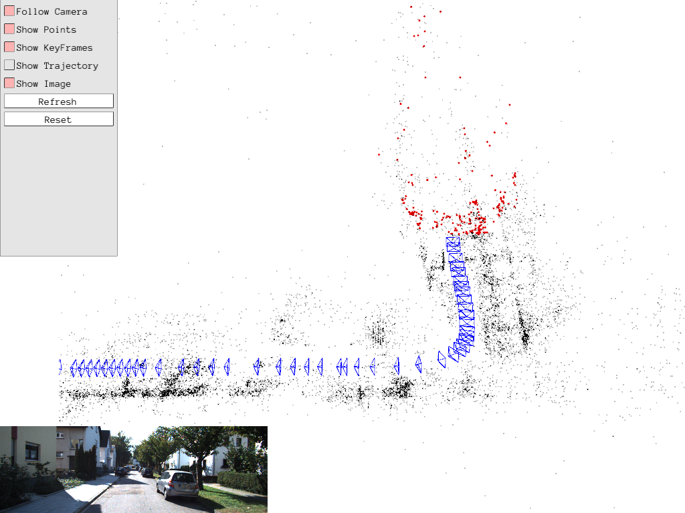

## About pangolin
[Pangolin](https://github.com/stevenlovegrove/Pangolin) is a lightweight portable library for managing OpenGL display and interaction.  For convenience,  I start up a project to implement a python binding for 3D visualization library Pangolin. 

## Required dependencies

* OpenGL 
	* (linux) `sudo apt install libgl1-mesa-dev`
* Glew
	* (linux) `sudo apt install libglew-dev`
	* (mac) `brew install glew`
* pybind11
	* `sudo python -mpip install numpy pyopengl Pillow pybind11`
* eigen
	* (linux) `sudo apt-get install libeigen3-dev`
	* (mac) `brew install eigen`

## Installation guide
Pangolin uses the CMake portable pre-build tool. To checkout and build pangolin in the directory 'build', execute the following at a shell (or the equivelent using a GUI):

```bashrc
$ git clone https://github.com/YunYang1994/pangolin.git
$ cd pangolin
$ mkdir build && cd build 
$ cmake ..
$ make -j8
$ cd ..
$ python setup.py install
```

## Example gallery

We have provided many exmaples of useage [here](https://github.com/YunYang1994/pangolin/tree/main/python/examples), enjoy it ! 


